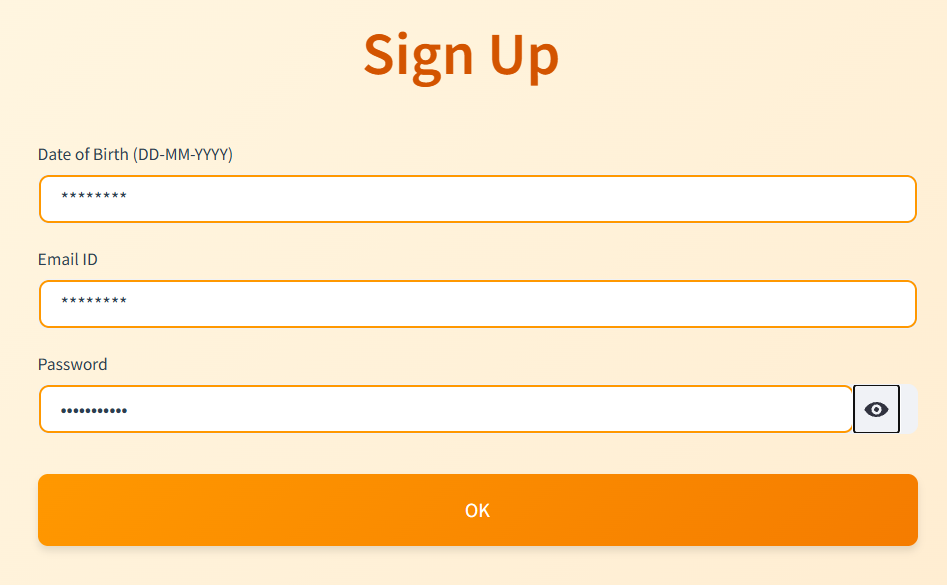
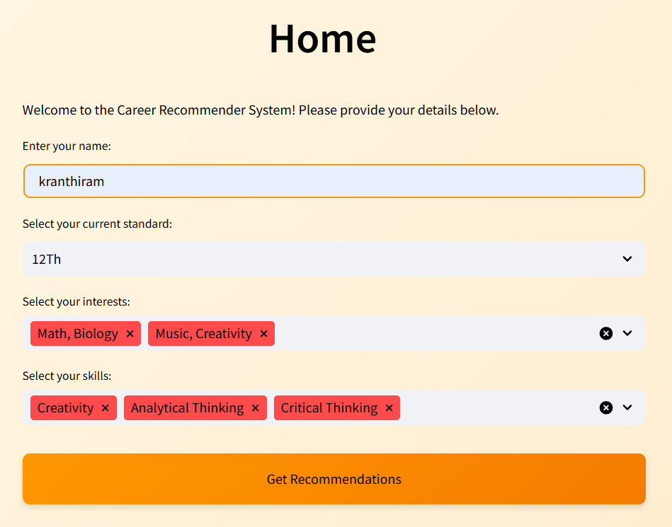
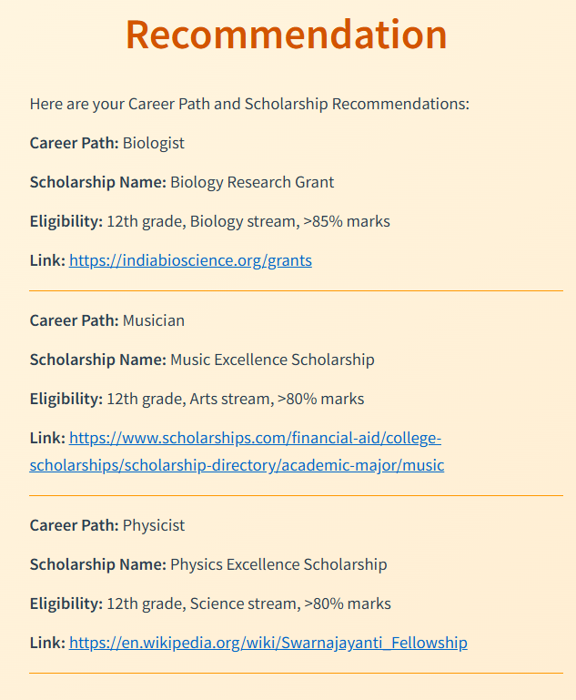
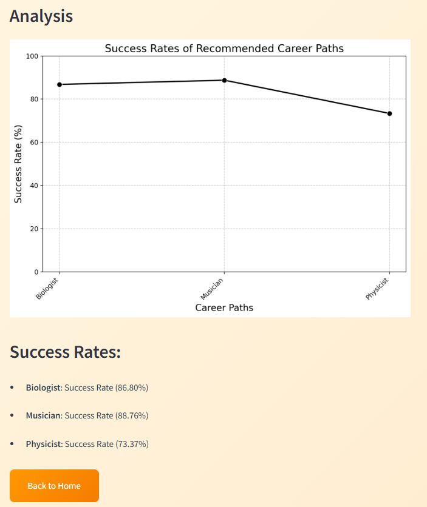

# Career Recommendation System

A simple **web-based career guidance application** that helps students (especially 12th graders) discover suitable career paths and scholarships based on their interests, skills, and current education level.

Users enter their details → system analyzes and recommends careers with success rate insights → displays matching scholarships with eligibility and links.

Built as a learning project to combine Python data processing with basic web interface.

## Tech Stack
- **Backend / Logic**: Python (data matching, analysis, success rate calculation)
- **Frontend**: HTML, CSS (simple forms, dynamic display, buttons)
- **Data**: CSV files (career datasets with success metrics)
- **Visualization**: Basic charts (e.g., line graph for success rates)
- **Tools**: Visual Studio Code, Git, GitHub

## Features
- User input form: Name, Current Standard (e.g., 12th), Multi-select Interests & Skills
- Personalized career recommendations based on profile matching
- Scholarship suggestions with eligibility criteria and external links
- Analytical visualization: Success rate comparison graph across recommended careers
- Clean UI with sections for Home, Recommendations, Analysis, and Back navigation

**Note**: This is a beginner-level project focused on full-flow application building. No advanced ML/database/login — uses static CSV data and simple logic.

## Screenshots

### 1. Sign-up Page 
  

### 2. Home / Input Page
  
User enters name, selects standard, adds interests (e.g., Math, Biology, Music, Creativity) and skills (e.g., Analytical Thinking, Critical Thinking).

### 3. Recommendation Page
  
Displays matched career paths (Biologist, Musician, Physicist) with scholarship names, eligibility, and links.

### 4. Analysis / Success Rates Chart
  
Shows success rates graph (line chart) and bullet list: Biologist (86.80%), Musician (88.76%), Physicist (73.37%).

### Clone the repo:
   ```bash
   git clone https://github.com/Kranthiram/Career_Recommendation_System.git
   cd Career_Recommendation_System
```
 ### **Learnings & Future Improvements**
Built simple rule-based / data-matching recommendation logic in Python.
Handled multi-select inputs and dynamic content display.
Created visual analysis (charts) to support recommendations.
Future: Add Flask for better web app, real database, more datasets, ML-based matching.

Feel free to fork or contribute!
